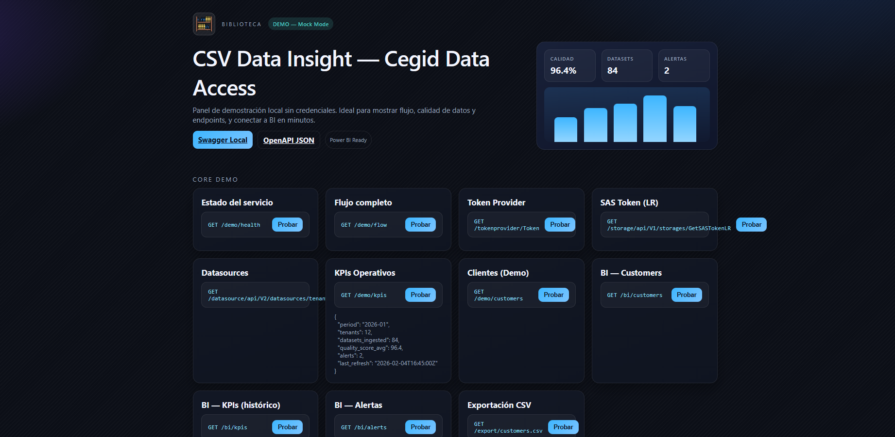

# CSV Data Insight

Plataforma para **ingesta, limpieza, normalización y publicación de datos** a partir de CSV heterogéneos.  
Entrega datasets listos para BI (Power BI, Superset, Metabase) y permite demostrar el flujo completo incluso sin credenciales reales.

---

## Highlights

- Pipeline completo: **ingesta → calidad → publicación BI**.  
- Endpoints **BI‑friendly** (JSON plano + CSV).  
- **Swagger local** para demo rápida.  
- Modo **mock** para presentar sin bloqueos.

---

## Demo Local (sin credenciales)

Arranca la app:

```bash
mvn spring-boot:run
```

Abre el panel:

```
http://localhost:8080/demo
```

Documentación local (Swagger):

```
http://localhost:8080/swagger-ui/index.html
```

OpenAPI JSON:

```
http://localhost:8080/v3/api-docs
```

---

## Vista rápida



---

## Power BI Quick Connect

### Opción A — JSON (Web)
1. Power BI Desktop → **Obtener datos** → **Web**.  
2. URL: `http://localhost:8080/bi/customers`  
3. Repite con:
   - `http://localhost:8080/bi/kpis`
   - `http://localhost:8080/bi/alerts`

### Opción B — CSV (Web)
1. Power BI Desktop → **Obtener datos** → **Web**.  
2. URL: `http://localhost:8080/export/kpis.csv`  
3. Repite con:
   - `http://localhost:8080/export/customers.csv`

---

## Demo Script

Guion listo para presentar en 3–5 minutos:

```
docs/demo-script.md
```

---

## Endpoints clave

**Flujo core**

```
GET /demo/health
GET /demo/flow
GET /tokenprovider/Token
GET /storage/api/V1/storages/GetSASTokenLR
GET /datasource/api/V2/datasources/tenant/{providerId}
```

**BI listo (JSON plano)**

```
GET /bi/customers
GET /bi/kpis
GET /bi/alerts
```

**Exportación CSV (Power BI)**

```
GET /export/customers.csv
GET /export/kpis.csv
```

---

## Integración real (Cegid)

1. Activa tu **Subscription Key** en el portal de Cegid.  
2. Obtén **api‑key‑id** y **api‑key‑secret** (si aplica).  
3. Desactiva el mock:

```yaml
cegid:
  mock:
    enabled: false
```

Cuando tengas credenciales reales, el flujo es:

```
Token Provider → SAS Token → Datasources/Collections → Publicación BI
```

---

## Arquitectura (visión)

- **Backend (Java, Spring Boot)**: orquesta datasets, calidad y persistencia.  
- **Microservicio (Python, FastAPI)**: profiling, métricas y especificaciones gráficas.  
- **Frontend (React)**: carga de CSV, calidad y dashboards.  
- **PostgreSQL**: capas `raw`, `core`, `mart`, `audit`, `meta`.

---

## Roadmap corto

- Conector real a Cegid con flujo completo.  
- Programación de ingestas (schedulers).  
- Panel de calidad con alertas y tendencias.  
- Exportación directa a Power BI datasets.

---

## Licencia

MIT — ver `LICENSE`.
